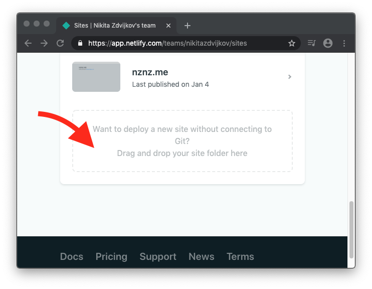
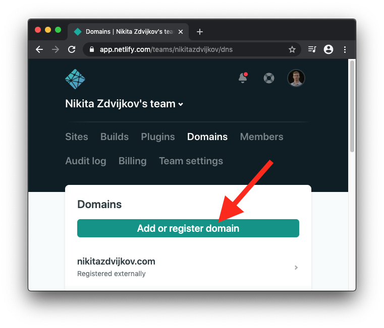
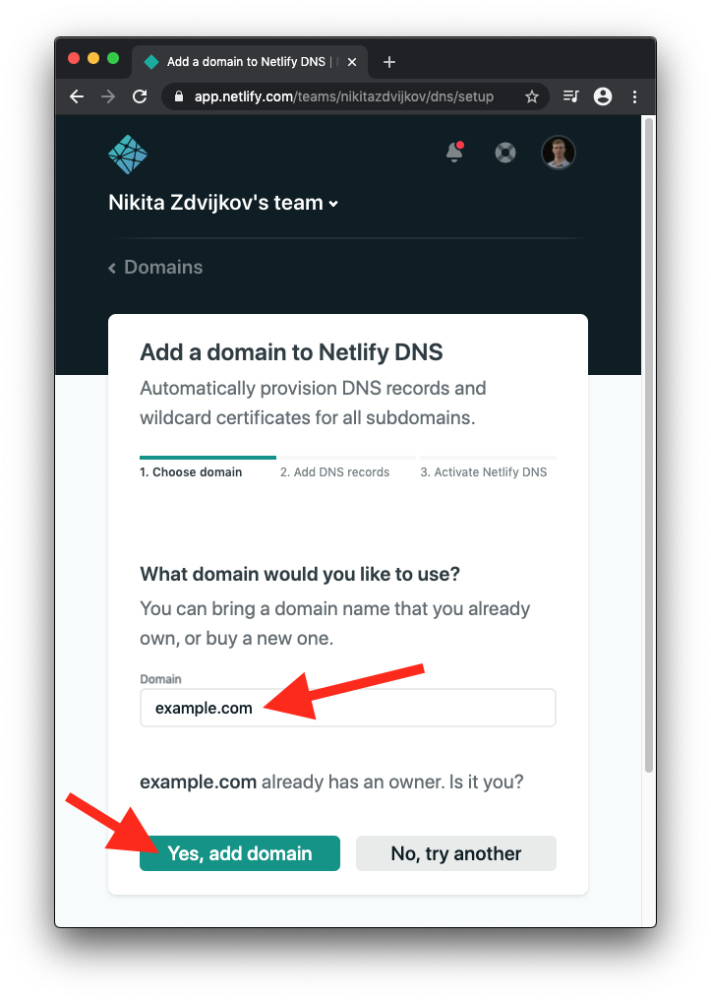
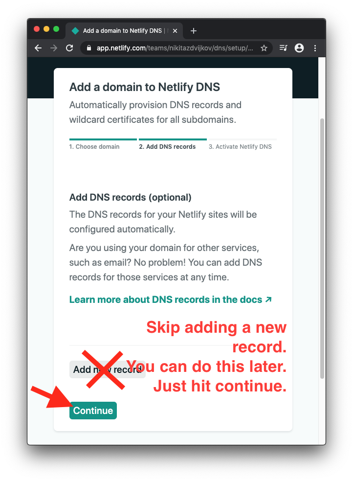
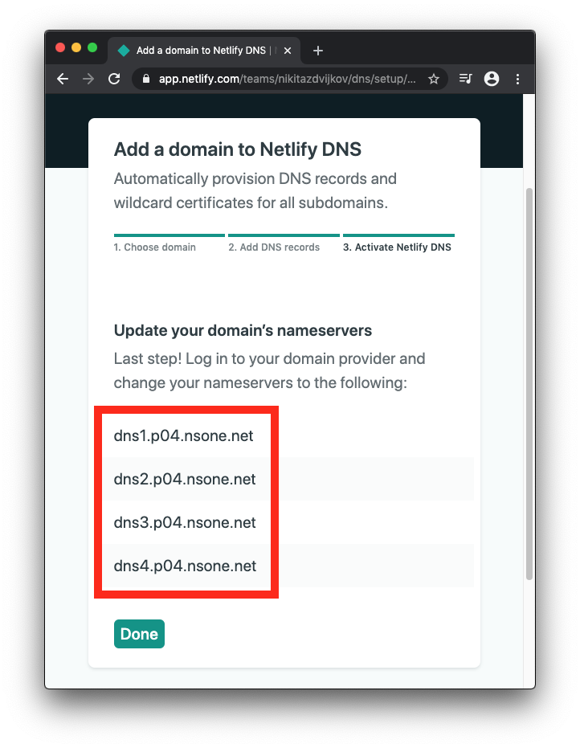

# Deploy a "hello world" Website to your Custom Domain in 5 Minutes

Part of *Personal Website* project in *TUACM Summer Mentorship Program &ndash; Web Dev Track with Nikita Zdvijkov*.

Back to the table of contents: https://go.nznz.me/acm-summer-mentorship-nz

## Intro

Don't bother trying to understand anything you do in this part. A later tutorial covers HTML.

## 1. Open an HTML file in your browser.

1. Make a new folder (a.k.a. a directory) on your desktop. Name it `my-first-website`.
2. Within that folder, make a file named `index.html` with the following content. If you don't have a code-friendly text editor already installed, follow [these](https://www.w3schools.com/html/html_editors.asp) instructions on how to make do with the text editor that comes with your computer. You'll install a proper text editor in the next tutorial.
```html
<!doctype html>

<html>

  <head>
    <title>this will show up in the tab name</title>
  </head>

  <body>
    <h1>Hello, world!</h1>
    <p>
      Firstname Lastname
      made this HTML document
      while following 
      <a href="https://go.nznz.me/acm-summer-mentorship-nz">this tutorial</a>.
    </p>
  </body>

</html>
```
2. Edit it with your first and last name. 
3. Right click on your HTML file, then go *open with > Google Chrome* &ndash; or whatever web browser you use. This is just like if you opened a PDF or JPG or PNG file on your computer with your browser &ndash; it's not yet on the public interet.

## 2. Buy a domain.

This is the only step of this project (and probably of the entire summer mentorship program) that will cost any money &ndash; and it's super cheap (can be less than three bucks a **year**).

From what I've read, NameCheap seems to be the most popular registrar among pro devs. I use it, and I've had no problems. That's why I recommend it.

[Affiliate link to NameCheap](https://go.nznz.me/namecheap) &ndash; meaning I get a kickback.

Use *beast mode* domain search. Pic below is also good for domain name extension ideas.


At checkout, keep *WhoisGuard* on (it's free forever). Also, they will try to upsell you *Premium DNS*, *Web Hosting*, *Positive SSL*, and *Email Hosting*. Don't buy those. I will show you free alternatives.

## 3. Create accounts.

Sign up for [GitHub](https://github.com/), then sign up for [Netlify](https://www.netlify.com/); I recommend signing up for Netlify **using your GitHub account** instead of email or whatever else.

## 4. Deploy to Netlify without custom domain.

We will deploy to the custom domain in the next step, but we have to do this first.

See screenshot below &ndash; simply drag and drop your `my-first-website` folder into Netlify. That's it.



At this point, Netlify will automatically give you a link of the form `https://example.netlify.app` where your HTML doc is published.

## 4. Connect to custom domain.

Follow the screenshots.



Enter the domain you just bought, click verify, then click yes.



Skip adding a new record. You can always do this later. Just hit continue.



Copy the nameservers Netlify gives you&hellip;



&hellip;and paste them into NameCheap. You'll have to switch from *NameCheap Basic DNS* to *Custom DNS*. Don't forget to hit the green check mark save button. NameCheap will probably give you different nameservers than it gave me. Also, don't get confused &ndash; the nameservers should be the same in Netlify and NameCheap &ndash; it's a mistake that they're different in the screenshots.


Go back to Netlify and check to see if it worked. Sometimes it takes a long time &ndash; up to a day &ndash; for these changes to take effect.

And that's it! After this, visitors to your custom domain will be greeted with your `index.html` file. Note that they *don't* have to go to *example.com/index.html* &ndash; just the domain by itself will work.
