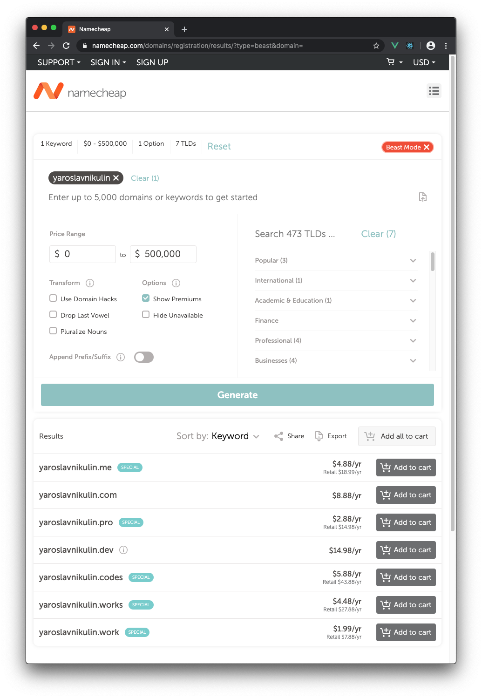

# First Assignment &middot; May 26, 2020

TUACM Summer Mentorship Program

Web Dev Track with Nikita Zdvijkov

Discord: https://discord.gg/QARTZud

## 1. Buy a domain through NameCheap.

**THIS IS THE ONLY STEP THAT WILL COST MONEY** &ndash; depending on the domain you buy, it could cost less than two bucks a year.

NameCheap is the favorite registrar among pro devs. I use it, and I've had no problems. That's why I recommend it.

Affiliate link to NameCheap: https://go.nznz.me/namecheap (shouldn't cost you extra &ndash; I get a kickback).

Use "beast mode" domain search:



At checkout &mdash; Keep WhoisGuard on (it's free forever). They will try to upsell you Premium DNS, Web Hosting, Positive SSL, and Email Hosting. Don't buy those &ndash; I will show you free alternatives.

## 2. Webpage from scratch with HTML/CSS.

### Do:

1. Watch https://youtu.be/bWPMSSsVdPk as an intro to HTML, but don't write your `hr` tags the way he does; this is the proper way today: `<hr>` (no closing tag for this one).
2. Watch https://youtu.be/0afZj1G0BIE as an intro to CSS.

### Takeaways:

Know this vocab: 
- HTML tag
- HTML attribute 
- HTML entity
- CSS property
- CSS selector

Also &mdash; Know that generally in HTML/CSS the `class` attribute is used to target multiple parts of a document (e.g. all the paragraphs), while the `id` attribute is used to target a single thing (e.g. the biography section heading in a wikipedia article).

Best HTML/CSS reference: https://www.w3schools.com/

## 3. Webpage with Bootstrap framework.

Bootstrap is "the most popular HTML, CSS, and JS library in the world".

1. Go to https://getbootstrap.com/.
2. Click get started button. 
3. Scroll down to starter template. Copy that into a `.html` file. I recommend you install [VSCode](https://code.visualstudio.com/) for a text editor at this point. It's the most popular one right now.
4. Save the file. Right click > open with browser. You should 

Try:
- Right click on a webpage > view source
- Right click on a webpage > inspect element

Try the above on a couple of my projects: https://nznz.me/ and https://nikitazdvijkov.com/fred

To learn Bootstrap, read the documentation on the website: https://getbootstrap.com/docs/4.5/components/card/

Pro tip: install the "Live Server" VSCode plugin by Ritwick Dey &ndash; should have over 5 million downloads. This way you don't have to refresh the browser to see the changes you make as you write code.

## 4. Publish.

1. Make a directory named `my-website`.
2. Put a file in there named `index.html`. When someone visits http://your-website.com/, this is the webpage they will see.
3. Within `my-website`, make a directory named `about`. 
4. Put a file in `my-website/about/` named `index.html`. When someone visits http://your-website.com/about/, this is the webpage they will see.

After following above steps your file structure should look like this:

```tree
my-website
├── index.html
└── about
    └── index.html
```

Note: if you're linking between pages on the same domain, it's better for portability (you can move website to another domain without breaking links) and development (you can use http://localhost without breaking links) &ndash; if you omit the domain name from the beginning of the `href` attribute URLs that link within the same website. For example, to link to about page from homepage, do this: 

```html
<a href="/about/">My about page.</a>
```

Don't do this:

```html
<a href="http://example.com/about/index.html">My about page.</a>
```

Also &ndsash; omit the `index.html` at the end of the links as shown above.

Now make a GitHub account, then make a [Netlify](https://www.netlify.com/) account using your GitHub account &ndash; this will make it easier to do the stuff I have planned for later, but you don't have to (could just sign up with email).

Follow [this](https://youtu.be/P-M7P_pzMLY) video for how to deploy your site to a non-custom domain. What do I mean by non-custom? The domain will look like https://nikitazdvijkov.netlify.app/ instead of http://nikitazdvijkov.com/. We will fix this in the next step.

## 4. Publish to custom domain.

Follow the prompts on Netlify to deploy your site to a custom domain. The pic below shows what you need to change on the domain registrar side of things. Note that it may take a while for your changes to take effect. **Netlify will probably give you DIFFERENT nameservers &ndash; do what Netlify tells you &ndash; don't copy from the pic.**


## 5. What now?

I'll have the next assignment for you soon. In the meantime, try to make a presentable personal website for yourself. Share your work in the Discord.

<!--

## Overview

1. Buy a domain through NameCheap.
2. Build a website using the Bootstrap framework.
3. Google Analytics & Search Console.
4. GitHub & Netlify for auto-deployment every time you push to the repo.
5. Cloudflare DNS.
6. URL shortener.
7. Email.

## 0. Intro

## 4. GitHub & Netlify for auto-deployment every time you push to the repo.

## 5. Cloudflare DNS.

## 6. URL shortener.

Demo: http://go.nznz.me/corona

## 7. Email.

## Conclusion

As you finish parts of the assignment, 

-->
